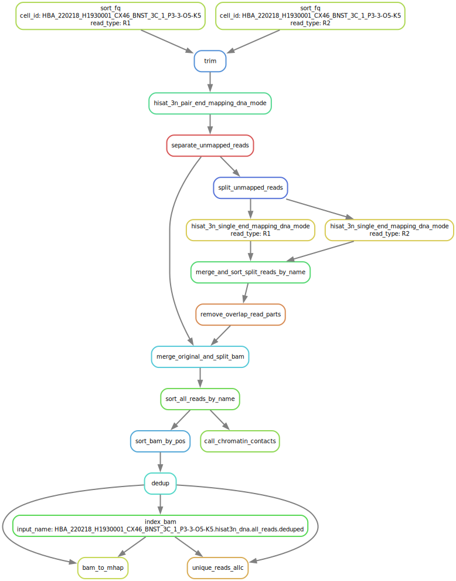

# Installation
## Create environment and install
```shell
conda install -y -n base -c conda-forge mamba
conda config --add channels defaults
conda config --add channels bioconda
conda config --add channels conda-forge

mamba env create -f https://raw.githubusercontent.com/DingWB/cemba_data/master/yap.yaml

# if failed, try:
# mamba env create -f https://raw.githubusercontent.com/DingWB/cemba_data/master/env_greedy.yaml
conda activate yap

# conda env export > env_greedy.yaml
```
## To install this latest version:
```shell
pip install git+https://github.com/DingWB/cemba_data

# reinstall
pip uninstall -y cemba_data && pip install git+https://github.com/DingWB/cemba_data

```

# Documentation
## Make sure create the right environment

## Generate config.ini
```shell
# m3c
yap default-mapping-config --mode m3c --barcode_version V2 --bismark_ref "~/Ref/mm10/mm10_ucsc_with_chrL.bismark1" --genome "~/Ref/mm10/mm10_ucsc_with_chrL.fa" --chrom_size_path "~/Ref/mm10/mm10_ucsc.nochrM.sizes" --hisat3n_dna_ref  "~/Ref/mm10/mm10_ucsc_with_chrL" > m3c_config.ini

#mC
yap default-mapping-config --mode mc --barcode_version V2 --bismark_ref "~/Ref/mm10/mm10_ucsc_with_chrL.bismark1" --genome "~/Ref/mm10/mm10_ucsc_with_chrL.fa" --chrom_size_path "~/Ref/mm10/mm10_ucsc.nochrM.sizes" --hisat3n_dna_ref  "~/Ref/mm10/mm10_ucsc_with_chrL" > mc_config.ini
# pay attention to the path of reference, should be the same as on the GCP if you are going to run the pipeline on GCP.    

# mct
# bismark & STAR for mct (bowtie2)
yap default-mapping-config --mode mct --barcode_version V2 --bismark_ref "~/Ref/mm10/mm10_ucsc_with_chrL.bismark2" --genome "~/Ref/mm10/mm10_ucsc_with_chrL.fa" --chrom_size_path "~/Ref/mm10/mm10_ucsc.nochrM.sizes" --gtf "~/Ref/mm10/annotations/gencode.vM23.annotation.gtf" --star_ref "~/Ref/mm10/star_ref" > mct_config.ini

# hisat-3n for mct    
yap default-mapping-config --mode mct --barcode_version V2 --hisat3n_dna_ref "~/Ref/mm10/mm10_ucsc_with_chrL" --hisat3n_rna_ref "~/Ref/mm10/mm10_ucsc_with_chrL" --genome "~/Ref/mm10/mm10_ucsc_with_chrL.fa" --chrom_size_path "~/Ref/mm10/mm10_ucsc.nochrM.sizes" --gtf "~/Ref/mm10/annotations/gencode.vM23.annotation.gtf" > mct_config.ini
```

## Demultiplex
```shell
# m3c
yap demultiplex --fastq_pattern "Pool_Remind1_m3c/*.fastq.gz" -o mapping/Pool_Remind1_m3c -j 16 --aligner hisat3n --config_path m3c_config.ini
# or
 yap-gcp run_demultiplex --fq_dir="Pool_Remind1_m3c" --outdir="mapping/Pool_Remind1_m3c" --gcp=False --n_jobs=16 --print_only=True 
 
# mc
 yap-gcp run_demultiplex --fq_dir="Pool_Remind1_mC" --outdir="mapping/Pool_Remind1_mC" --gcp=False --n_jobs=16 --print_only=True 
```

## Run mapping
```shell
sh mapping/snakemake/qsub/snakemake_cmd.txt # old yap pipeline
# or new yap-gcp pipeline
yap-gcp run_mapping --workd="mapping/Pool_Remind1_m3c" --gcp=False --config_path="m3c_config.ini" --aligner='hisat-3n' --n_jobs=64 --print_only=True
# or bismark
yap-gcp run_mapping --workd="mapping" --gcp=False --config_path="m3c_config.ini" --aligner='bismark' --n_jobs=64 --print_only=True
sh mapping/snakemake/qsub/snakemake_cmd.txt
```

## Workflow


### (5) yap vs yap-gcp: example on m3c
```shell
# generate config.ini; bismark
yap default-mapping-config --mode m3c --barcode_version V2 --bismark_ref "~/Ref/hg38/hg38_ucsc_with_chrL.bismark1" --genome " ~/Ref/hg38/hg38_ucsc_with_chrL.fa" --chrom_size_path " ~/Ref/hg38/hg38_ucsc.nochrM.sizes" > m3c_config.ini
# hisat3n
yap default-mapping-config --mode m3c --barcode_version V2 --hisat3n_dna_ref  "~/Ref/hg38/hg38_ucsc_with_chrL" --genome " ~/Ref/hg38/hg38_ucsc_with_chrL.fa" --chrom_size_path " ~/Ref/hg38/hg38_ucsc.nochrM.sizes" > m3c_hisat3n_config.ini

# (1). old yap pipeline
## demultiplex
yap demultiplex --fastq_pattern "/gale/raidix/rdx-2/illumina_runs/240322_M00412_0796_000000000-GK7K5_240325081847048305907-1/SALK054/*.fastq.gz" -o mapping -j 16 --aligner bismark --config_path m3c_config.ini #/usr/bin/time -f "%e\t%M\t%P" ;  2125.33 500364  195%
# elapsed real time (wall clock) in seconds; maximum resident set size in KB;  percent of CPU this job got
## mapping
sh mapping/snakemake/qsub/snakemake_cmd.txt
# /usr/bin/time -f "%e\t%M\t%P" UWA7648_CX2324_THM1_3_P12-2-N8 ; run one uid, 16 cpus; 4514.82 3393988 367%

# (2). new yap-gcp pipeline, run on local HPC (faster)
yap-gcp run_demultiplex --fq_dir=" /gale/raidix/rdx-2/illumina_runs/240322_M00412_0796_000000000-GK7K5_240325081847048305907-1/SALK054/" --outdir="mapping" --gcp=False --n_jobs=16
# time and memory usage: 69.52   282008  754%; 30X faster
yap-gcp run_mapping --workd="mapping" --gcp=False --config_path="m3c_config.ini" --aligner='bismark' --n_jobs=64 --print_only=True
sh mapping/snakemake/qsub/snakemake_cmd.txt
```